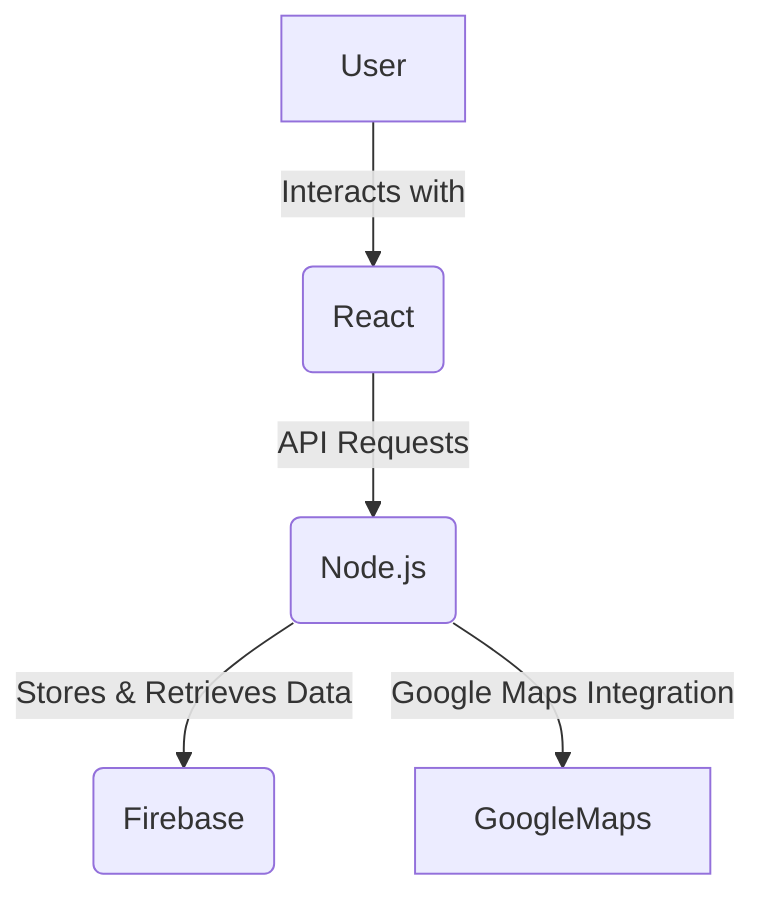
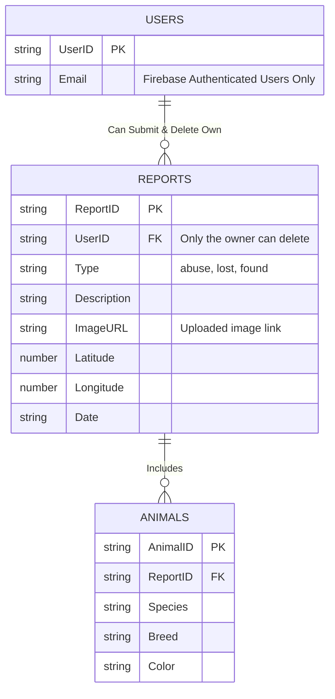

# Pawtner: Pet Support Platform

In many countries, stray animals and cases of animal abuse are common and often go unaddressed. Pawtner is a web-based platform designed to allow users to report **animal abuse** and **lost/found pets** efficiently. The platform integrates **Google Maps API** to enable precise location reporting and **Firebase** for authentication and data management.


Live demo: https://pawtnerfront.onrender.com

## **Core Features**
1. **Report Animal Abuse**  
   - Users can report cases of animal abuse with details like location, description, and images.
   - The reports appear on an **interactive map** for community awareness.

2. **Report Lost and Found Animals**  
   - Users can report lost or found animals, helping to reunite pets with their owners.
   - Reports include images, breed, and last known location.

3. **View Reports on an Interactive Map**  
   - Users can see all reports plotted on **Google Maps**.
   - Clicking on a marker opens a **detailed view** with an expandable info window.

4. **Anonymous or Authenticated Reporting**  
   - Users **can submit reports anonymously**.
   - Logged-in users (via **Firebase Authentication**) can manage and delete their own reports.

5. **Modern UI with React**  
   - Fully responsive and optimized for a seamless user experience.
   - **Dark mode support**
  
6. **Update the report**
   -Users can update their reports 

## **Technologies Used**
- **Frontend:** React, Vite, Tailwind CSS
- **Backend:** Node.js, Express.js, Firebase Firestore
- **Authentication:** Firebase Authentication
- **Database:** Firebase Firestore
- **Maps API:** Google Maps JavaScript API (@vis.gl/react-google-maps)
- **State Management:** React Hooks (`useState`, `useEffect`)
- **Deployment:** Firebase Hosting (optional)
- **Development Tools:** Postman, VS Code, Git/GitHub

---

## **Frontend Implementation**
The frontend is built with React and uses @vis.gl/react-google-maps for map integration.

**Google Maps Integration**
```javascript
import { APIProvider, Map, Marker } from "@vis.gl/react-google-maps";

export default function ReportMap({ updateLocationOnForm }) {
    const handleMapClick = (event) => {
        if (event.detail) {
            const { lat, lng } = event.detail.latLng;
            updateLocationOnForm(lat, lng);
        }
    };

    return (
        <div className="map-container">
            <APIProvider apiKey={import.meta.env.VITE_ANIMALMAP}>
                <Map
                    defaultCenter={{ lat: 49.282729, lng: -123.120738 }}
                    defaultZoom={12}
                    onClick={handleMapClick}
                    disableDefaultUI={true}
                />
            </APIProvider>
        </div>
    );
}
```
**Interactive Report Cards with Expandable Info**

```javascript
import { useState } from "react";

export default function ReportCard({ report }) {
    const [expanded, setExpanded] = useState(false);

    return (
        <div className={`report-card ${expanded ? "expanded" : ""}`}>
            
            <p><strong>Type:</strong> {report.type}</p>
            <p><strong>Date:</strong> {report.date}</p>
            
            {expanded && (
                <>
                    <p><strong>Animal:</strong> {report.animal}</p>
                    <p><strong>Description:</strong> {report.description}</p>
                </>
            )}

            <button onClick={() => setExpanded(!expanded)}>
                {expanded ? "Show Less" : "More Info"}
            </button>
        </div>
    );
}

```


## **Backend Implementation**

The backend is built with Node.js + Express.js and connects to Firebase Firestore for data storage.

**API Endpoints**
| Method | Endpoint                | Description                                                                     |
|--------|-------------------------|---------------------------------------------------------------------------------|
| POST   | /reports                | 	Creates a new report, allowing image uploads. Requires authentication (token) |
| GET    | /reports                | 	Retrieves all reports stored in Firebase Firestore                            |
| DELETE | /reports/:id            |   Deletes a specific report by ID.                                              |
| PUT    | /reports/:id            |   Edit the report information                                                   |  


## CRUD operations:

## Reports Table
| Action  | Description                                                    |
|---------|----------------------------------------------------------------|
| Create  |Add a new report when a user submits one, allowing image uploads|
| Read    | Retrieve all reports to display on the map or in a list        |
| Delete  | Remove a report by ID (only for authenticated users)           |
| Update  | Update the report                                              |


## **Development Instructions**
To run the Pawtner: Pet Support Platform, follow these setup steps:

1. **Prerequisites**
   - You must have a Firebase project configured with the following services enabled:
   -  Storage (for image uploads)
   -  Authentication (for user login and report ownership tracking)
   -  Firestore Database (to store reports)
     
✅ Google Maps API must be enabled in your Google Cloud Console to use location services.

✅ Install Node.js and npm before proceeding.


2. **Project Setup**
   
For both the frontend and backend, install dependencies by running:

```bash
npm install

```

6. **Database Configuration**
   
Pawtner stores reports in Firebase Firestore. The database should be structured as follows:

```bash
/reports
    ├── {reportId}
    │   ├── type: "lost" | "found" | "abuse"
    │   ├── animal: "Dog"
    │   ├── breed: "Beagle"
    │   ├── date: "YYYY-MM-DD"
    │   ├── email: "user@example.com"
    │   ├── location: { lat: 49.2827, lng: -123.1207 }
    │   ├── imageUrl: "https://storage.googleapis.com/bucket-name/uploads/animal.jpg"
    │   ├── user_id: "firebase_user_id"

```

4. **Frontend Setup**
   
✅ Steps to Start the Frontend:

 - Ensure that Google Maps API is enabled in Google Cloud Console.
 - Run the following command to start the development server:
```bash
npm run dev
```

5. **Backend Setup**

✅ Steps to Start the Backend:

 - Generate a Firebase Service Account JSON file, download it, and place it in the project root directory.
 - Run the following command to initialize the backend server:
```bash
npm run init
```

## The Google Maps API will be used for:

1.	Geolocation:
   
o	Allow users to select or view the location of a report (abuse, lost/found animal) on the map.
o	Display markers on the map for registered reports.


## Data Flow
1.	The user selects a location on the map.
2.	The frontend captures the latitude and longitude from the map click event and updates the form fields.
3.	When the user submits a report, the form data (including coordinates and image) is sent to the backend.
4.	When an image is uploaded, the backend stores it in Firebase Storage and generates a public image URL.
5.	The backend stores the report in Firestore, linking it with the image URL and the user ID (if authenticated).
6.	The frontend retrieves all reports from the backend, including their coordinates and images.
7.	The reports are displayed as markers on the Google Map, allowing users to click and view details inside an expandable InfoWindow.


## **System Architecture**

The **Pawtner** platform follows a **three-tier architecture**:
- The **Frontend** (React) handles user interactions.
- The **Backend** (Node.js + Express) manages API requests and connects to the database.
- The **Database** (Firebase Firestore) stores reports, user data, and image URLs.

Below is an interactive diagram representing the data flow:


## **Database Schema Design**

Pawtner allows **authenticated users** to report, view, and delete their own **lost, found, or abused animal reports**.  
**Unauthenticated users** can **only view** reports but **cannot create or delete them**.

Below is the updated database schema:




## Home page
This page contains a catchy phrase and below it a summary of the project's purpose.


## Report page
On this page, if the user is authenticated, a map will be shown where the user will select a place and then fill in the report information.


Below the form to submit a report there will also be a button to return to the map in case the user selected the wrong place.


If the user is not authenticated, the reports page will appear like this:


## View reports
The view page can be accessed even by unauthenticated users, it will contain the map with the corresponding pins on it and when clicked it will show the reports made in that place.


If the user is authenticated, he will be able to see his reports already made below and can delete them if he wants.


If the authenticated user has not yet made any reports, the page display will be like this


## Login page

On this page the user can log in if they already have an account.


## Create an account

On this page the user will create their account


